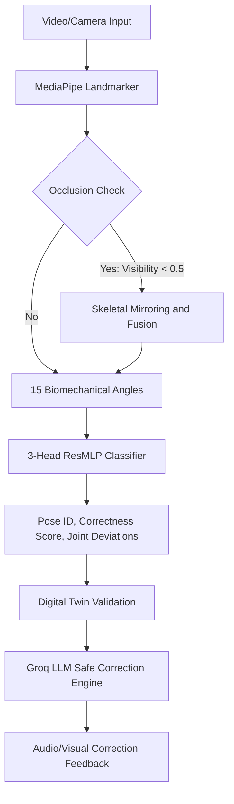

# Smart Yoga Posture Correction System

An advanced, production-grade dual-model system for real-time yoga pose classification, posture correctness evaluation, joint deviation regression, and intelligent voice correction generation. Designed as a final-year project at the RCC Institute of Information Technology, Kolkata, Department of Computer Science & Engineering.

---

## 🌟 Key Features

*   **Dual-Model Hybrid Architecture**:
    *   **3-Head ResMLP Classifier**: Evaluates frame-level pose ID (23 classes), overall posture correctness logit, and 15 joint deviation values simultaneously.
    *   **Sequence Flow Classifier (ST-GCN/GRU-Attention)**: Processes 60-frame coordinate sequences with self-attention pooling for scale and translation invariant flow verification.
*   **Occlusion Recovery Protocol**: Fuses coordinates and mirrors skeletal landmarks when limbs are occluded (MediaPipe threshold < 0.5) to keep predictions stable.
*   **Personalised Digital Twin limits**: Calibrates joints to match user mobility profiles, preventing incorrect warnings for physical constraints.
*   **LLM Guidance Engine**: Integrates with the **Groq API** (Llama-3-8B) to generate natural, fluid, and multi-lingual voice feedback, bounded strictly by safety filters to prevent injuries.
*   **Production Deployment Ready**: Equipped with Docker configurations and Uvicorn deployment targets optimized for low-resource servers (e.g. 4GB RAM) running on port `7860`.

---

## 🏗️ Architecture



---

## 📊 Best Training Performance

### 1. Multi-Output 3-Head MLP
*   **Best Validation Loss**: `0.2263`
*   **Validation Pose Accuracy**: `93.38%`
*   **Validation Correctness Accuracy**: `96.81%`

| Epoch | Train Loss | Train Pose Acc | Val Loss | Val Pose Acc | Val Correctness Acc |
| :--- | :--- | :--- | :--- | :--- | :--- |
| Epoch 01 | 0.8631 | 79.04% | 0.5059 | 86.08% | 92.83% |
| Epoch 10 | 0.4389 | 88.33% | 0.3079 | 91.43% | 95.30% |
| Epoch 30 | 0.3597 | 90.42% | 0.2545 | 92.22% | 96.42% |
| **Epoch 39** | **0.3224** | **91.36%** | **0.2263** | **93.38%** | **96.81%** |

### 2. Sequence Flow Classifier (ST-GCN/GRU-Attention)
*   **Best Validation Accuracy**: `75.25%` (Epoch 90, early-stopped at Epoch 110).

---

## 🚀 Getting Started

### Prerequisites
*   Python 3.9+ or Docker
*   A Hugging Face account and Groq API key

### Installation

1. Clone the repository:
   ```bash
   git clone https://github.com/Anamitra-Sarkar/yoga-posture-correction-system.git
   cd yoga-posture-correction-system
   ```

2. Set up environment variables:
   ```bash
   export HF_TOKEN="your_huggingface_token"
   ```

3. Run with Docker:
   ```bash
   docker build -t yoga-backend .
   docker run -p 7860:7860 -e HF_TOKEN=$HF_TOKEN yoga-backend
   ```

4. Or run locally:
   ```bash
   pip install -r backend/requirements.txt
   cd backend
   uvicorn app.main:app --host 0.0.0.0 --port 7860
   ```

---

## 🛠️ Repository Directory Structure

*   `backend/`: Modular FastAPI app layout, Dockerfile, and requirements.
*   `frontend/`: TypeScript Next.js hooks and API interfaces for the client.
*   `.github/workflows/hf_sync.yml`: Automates CI/CD synchronization of the backend folder to Hugging Face Spaces.

---

## 📄 License & Attribution

This project is licensed under the **Creative Commons Attribution-NonCommercial-ShareAlike 4.0 International (CC BY-NC-SA 4.0)** license.

### Attribution Required:
Any research, commercial projects, derivatives, or code reuse of this repository must give appropriate credit. Please cite:
*   **Anamitra Sarkar** (Anamitra-Sarkar)
*   **Arko**

### Restrictions:
*   **NonCommercial**: You may not use the material for commercial purposes.
*   **ShareAlike**: If you remix, transform, or build upon the material, you must distribute your contributions under the same license.
